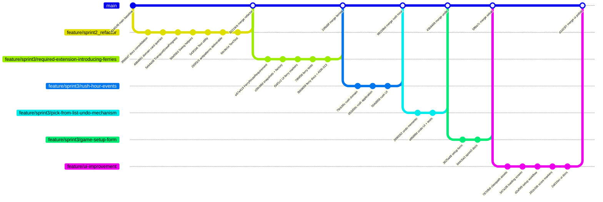

# Git Branching and Merging Evidence

This document records the repository's branching strategy and the Sprint 3 merge
history for assessment evidence (marking rubric: *Evidence of branching and
merging*).

## Branching Strategy

The project follows the conventions in `CONTRIBUTING.md`:

| Branch pattern | Purpose | Example |
|---|---|---|
| `main` | Stable, passing code only | `main` |
| `feature/<name>` | New features or deliverables | `feature/sprint3/required-extension-introducing-ferries` |
| `refactor/<name>` | Refactoring without new features | `feature/sprint2_refactor` |
| `appmod/<name>` | Toolchain or build upgrades | `appmod/java-upgrade-20260526152052` |

Feature work is developed on a dedicated branch, verified with `mvn verify`,
then merged into `main` using **`--no-ff`** so merge commits preserve branch
boundaries in history.

## Sprint 3 Branch Flow



## Sprint 3 Feature Branches

### 1. `feature/sprint2_refactor`

**Purpose:** Sprint 3 anti-pattern refactorings and design-documentation
consolidation (deliverable: `antipatterns_and_refactoring.md`).

**Merged to `main`:** commit `32319cb` (2026-05-31)

| Commit | Summary |
|---|---|
| `3f666d7` | doc: consolidate design guidance and clarify documentation hierarchy |
| `4984861` | refactor(domain): add card-supply query methods to deck and face-up display |
| `5eb4a38` | refactor(application): introduce transport draw progress and use domain card queries |
| `50e00b3` | refactor(ui): extract shared Swing helpers for actions and ticket selection |
| `543f1b6` | refactor: consolidate blank-text validation in domain.common.Text |
| `285f3c5` | docs: add Sprint 3 antipatterns deliverable and update tracking |
| `66c9e1e` | test: lock Text validation contract and close known residual risk |

### 2. `feature/sprint3/required-extension-introducing-ferries`

**Purpose:** Sprint 3 **required extension** — Introducing Ferries on Thames
routes `R28`, `R39`, `R42`, and `R43`. Specification:
`sprint3/required_extension_introducing_ferries.md`.

**Merged to `main`:** commit `10f6d9f` (2026-05-31)

| Commit | Summary |
|---|---|
| `e87e419` | feat(domain): add FerryRouteRequirement strategy for Thames ferry routes |
| `c09c98d` | feat(application): wire ferry routes through snapshots and BoardFactory |
| `f34f1c2` | feat(ui): render ferry Bus-symbol markers and claim-route hints |
| `79f4f58` | test: add ferry route claiming, factory, and view-model coverage |
| `3bb9659` | docs: add Sprint 3 ferry extension specification and ADR-013 |

### 3. `feature/sprint3/rush-hour-events`

**Purpose:** Sprint 3 **self-defined extension** — Rush Hour Events (forecast/peak
route bonuses). Specification: `sprint3/self_defined_extension.md`. ADR-015.

**Merged to `main`:** commit `98159bd` (2026-05-31). Branch deleted after merge.

| Commit | Summary |
|---|---|
| `79cb36c` | feat(domain): add Rush Hour events manager and Thames route selectors |
| `053d50c` | feat(application): wire Rush Hour claiming, snapshots, and factory setup |
| `504d958` | feat(ui): render Rush Hour forecast panel and affected route highlights |

### 4. `feature/sprint3/pick-from-list-undo-mechanism`

**Purpose:** Sprint 3 **pick-from-the-list extension** — bounded two-turn undo via
Memento. Plan: `sprint3/pick_from_list_undo_mechanism_plan.md`. ADR-014.

**Merged to `main`:** commit `43b9469` (2026-05-31). Branch deleted after merge.

| Commit | Summary |
|---|---|
| `2690062` | feat(application): add bounded two-turn undo with GameMemento history |
| `e8fd99d` | feat(ui): expose Undo action and add application undo rule tests |

### 5. `feature/sprint3/game-setup-form`

**Purpose:** Reusable pre-game setup UI (`GameSetupForm`, `PlayerSetupConfiguration`)
with focused Swing/infrastructure tests.

**Merged to `main`:** commit `5ff8a7c` (2026-05-31). Branch deleted after merge.

| Commit | Summary |
|---|---|
| `3625a48` | feat(ui): add reusable game setup form with player colour selection |
| `844c5a3` | docs: record Sprint 3 extension progress |

### 6. `feature/ui-improvement`

**Purpose:** Swing UI polish — packaged board/loading/setup artwork, startup loading
screen, consolidated setup workflow, board-edge score markers, and side-panel layout
rebalance.

**Merged to `main`:** commit `d1d23f7` (2026-05-31). Branch deleted after merge.

| Commit | Summary |
|---|---|
| `7870fb9` | chore: package UI assets on classpath and tighten git hygiene |
| `347a1f6` | feat(ui): add startup loading screen and classpath image loading |
| `d2af5f9` | feat(ui): consolidate game setup into a single workflow window |
| `282e1bb` | feat(ui): add board-edge score markers and rebalance side panel layout |
| `2a610ec` | docs: record UI loading, setup workflow, and score marker progress |

## Merge Commits on `main`

| Merge commit | Source branch | Description |
|---|---|---|
| `d1d23f7` | `feature/ui-improvement` | UI loading screen, setup workflow, and score markers |
| `5ff8a7c` | `feature/sprint3/game-setup-form` | Pre-game setup form and player configuration |
| `43b9469` | `feature/sprint3/pick-from-list-undo-mechanism` | Pick-from-the-list Undo extension |
| `98159bd` | `feature/sprint3/rush-hour-events` | Rush Hour Events self-defined extension |
| `10f6d9f` | `feature/sprint3/required-extension-introducing-ferries` | Sprint 3 required Ferry extension |
| `32319cb` | `feature/sprint2_refactor` | Sprint 3 anti-pattern refactorings |
| `2541e42` | `appmod/java-upgrade-20260526152052` | Java 25 / Maven build upgrade |
| `ccde7a6` | `feature/user_interaction` | Sprint 2 user interaction flow |
| `4b9e824` | `feature/scoring` | Sprint 2 scoring |
| `5df5879` | `feature/application_layer` | Application layer |
| `9a01425` | `feature/factories_and_game_data` | Factories and game data |
| `980a775` | `feature/core_implementation_and_tests` | Core implementation |
| `a29122f` | `feature/domain_model_skeleton` | Domain model skeleton |
| `9151fa7` | `feature/model-foundation` | Model foundation |

After reconciling local and remote histories, equivalent remote merge commits
(`85bc918`, `315b96e`, `08aa681`) also remain reachable via `git log --merges`.

## How to Verify Locally

From the repository root:

```powershell
# Show branch topology and merge commits
git log --oneline --graph --decorate -25

# List merge commits only
git log --merges --oneline

# Show Sprint 3 extension merge commits
git log --merges --oneline --grep="feature/sprint3"

# Confirm working tree is clean and main is synced with origin
git status
```

Expected current state after Sprint 3 merges:

- `main` tip: run `git log -1 --oneline main` to confirm the current head
- Sprint 3 extension feature branches **deleted locally** after `--no-ff` merge (history
  preserved in merge commits and feature-branch commits reachable via `git log`)
- `mvn verify`: 106 tests pass, 0 Checkstyle violations

## Future Sprint 3 Extensions

When implementing additional extensions, create a new branch from `main`:

```powershell
git checkout main
git pull   # if working with remote
git checkout -b feature/sprint3/<extension-name>
# ... implement, commit, verify ...
git checkout main
git merge --no-ff feature/sprint3/<extension-name>
git branch -d feature/sprint3/<extension-name>
```
