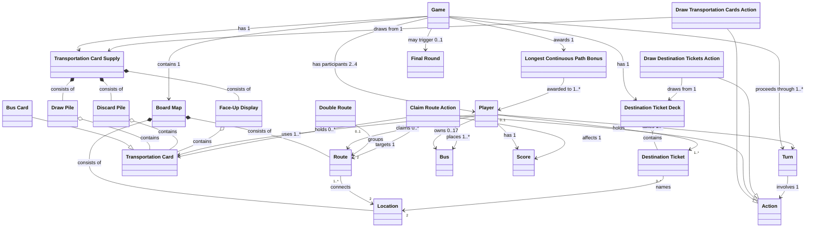

# Ticket to Ride: London -- Domain Model

This domain model captures the **problem space** of the Ticket to Ride: London board game.
It contains only domain **entities/concepts** and **relationships** -- no attributes, no behaviour, no implementation detail.

Produced following the iterative workflow in `domain_model_ai_guide.md`.

---

## 1. Candidate Entity Extraction

Nouns and concepts extracted from the game rules:

Game, Player, Board Map, Location, Route, Ferry Route, Transportation Card, Bus Card, Destination Ticket, Bus (plastic piece), Scoring Marker, Scoring Track, Turn, Action, Draw Transportation Cards (action), Claim Route (action), Draw Destination Tickets (action), Transportation Card Supply, Discard Pile, Face-Up Display, Draw Pile, Destination Ticket Deck, Route Colour, Card Colour, Player Colour, Double Route, Longest Continuous Path, Longest Continuous Path Bonus, Final Round, Score, Point Value, Route Length, Connected Path, Hand (of cards)

---

## 2. Removed / Merged Concepts

| Removed / Merged | Reason |
|---|---|
| Scoring Marker, Scoring Track | Physical representation of Score -- merged into the concept of Score |
| Route Colour, Card Colour, Player Colour | These are attributes/properties of their parent concepts, not standalone entities |
| Route Length, Point Value | Attributes, not entities |
| Connected Path | An algorithmic concept used during scoring; captured by the relationship between Player, Route, and Destination Ticket completion |
| Hand | A player's collection of cards -- modelled as the relationship "Player holds Transportation Card / Destination Ticket" |

---

## 3. Final Entity List (23 concepts)

1. **Game** -- the overarching game session
2. **Player** -- a participant in the game
3. **Board Map** -- the shared playing surface (London transportation network)
4. **Location** -- a named place on the board (e.g., Baker Street, Big Ben)
5. **Route** -- a printed connection between two adjacent Locations
6. **Double Route** -- a constraint grouping of two parallel routes between the same two Locations
7. **Transportation Card** -- a card used as currency to claim routes
8. **Bus Card** -- a special wild Transportation Card (multi-coloured)
9. **Destination Ticket** -- a secret goal card connecting two Locations
10. **Bus** -- a plastic playing piece placed on claimed routes
11. **Score** -- accumulated points for a player
12. **Turn** -- one player's opportunity to act
13. **Action** -- the chosen operation within a turn
14. **Draw Transportation Cards Action** -- drawing cards from supply
15. **Claim Route Action** -- paying cards to claim a route
16. **Draw Destination Tickets Action** -- drawing goal tickets
17. **Transportation Card Supply** -- the overall pool of transportation cards (draw pile, discard pile, face-up display)
18. **Draw Pile** -- the face-down stack of transportation cards
19. **Discard Pile** -- used transportation cards awaiting reshuffle
20. **Face-Up Display** -- the five visible selectable cards
21. **Destination Ticket Deck** -- the stack of destination tickets
22. **Longest Continuous Path Bonus** -- the endgame +10 point award
23. **Final Round** -- the triggered endgame sequence

---

## 4. Relationships

### 4.1 Generalisations (hollow-triangle arrow)

```
Bus Card --|> Transportation Card

Draw Transportation Cards Action --|> Action
Claim Route Action                --|> Action
Draw Destination Tickets Action   --|> Action
```

**Justifications:**

- **Bus Card is a kind of Transportation Card**: The rules treat Bus cards as special wild cards with unique drawing constraints (taking a face-up Bus card limits the draw to one card; a face-up Bus card cannot be taken as a second card) and payment flexibility (substitutes for any colour). This warrants a distinct subtype.
- **Three Action subtypes**: The rules define exactly three mutually exclusive actions per turn. Generalisation cleanly captures this "exactly one of three" domain constraint.

### 4.2 Compositions (filled-diamond)

```
Board Map *--consists of--> Location       (1 to 1..*)
Board Map *--consists of--> Route          (1 to 1..*)

Transportation Card Supply *--consists of--> Draw Pile       (1 to 1)
Transportation Card Supply *--consists of--> Discard Pile    (1 to 1)
Transportation Card Supply *--consists of--> Face-Up Display (1 to 1)
```

**Justifications:**

- **Board Map composes Location and Route**: Locations and Routes are defined by and exist only within the context of a specific Board Map. They have no independent existence outside it.
- **Transportation Card Supply composes Draw Pile, Discard Pile, Face-Up Display**: These three sub-structures are tightly coupled parts of the same card supply system. Cards flow between them (reshuffle, replacement, discard), but the piles themselves do not exist independently outside the supply.

### 4.3 Aggregations (hollow-diamond)

```
Draw Pile       o--contains--> Transportation Card    (1 to 0..*)
Discard Pile    o--contains--> Transportation Card    (1 to 0..*)
Face-Up Display o--contains--> Transportation Card    (1 to 0..5)

Destination Ticket Deck o--contains--> Destination Ticket (1 to 0..*)
```

**Justifications:**

- Cards move freely between the Draw Pile, Discard Pile, Face-Up Display, and Player hands. The cards exist independently of any particular pile, so aggregation (not composition) is appropriate.
- Destination Tickets similarly move from the deck to player hands and can be returned to the bottom of the deck.

### 4.4 Associations (plain line with labels and cardinality)

```
Game --contains---------> Board Map                  (1 to 1)
Game --has participants--> Player                    (1 to 2..4)
Game --has---------------> Transportation Card Supply (1 to 1)
Game --has---------------> Destination Ticket Deck   (1 to 1)
Game --proceeds through--> Turn                      (1 to 1..*)
Game --may trigger-------> Final Round               (1 to 0..1)
Game --awards------------> Longest Continuous Path Bonus (1 to 1)

Player --holds-----------> Transportation Card       (1 to 0..*)
Player --holds-----------> Destination Ticket        (0..1 to 1..*)
Player --owns------------> Bus                       (1 to 0..17)
Player --claims----------> Route                     (0..1 to 0..*)
Player --has-------------> Score                     (1 to 1)
Player --takes-----------> Turn                      (1 to 1..*)

Turn --involves----------> Action                    (1 to 1)

Route --connects---------> Location                  (1..* to 2)
Destination Ticket --names-> Location                (0..* to 2)
Double Route --groups----> Route                     (0..1 to 2)

Claim Route Action --targets--> Route                (1 to 1)
Claim Route Action --uses-----> Transportation Card  (1 to 1..*)
Claim Route Action --places---> Bus                  (1 to 1..*)
Claim Route Action --affects--> Score                (1 to 1)

Draw Transportation Cards Action --draws from--> Transportation Card Supply  (1 to 1)
Draw Destination Tickets Action --draws from--> Destination Ticket Deck (1 to 1)

Longest Continuous Path Bonus --awarded to--> Player (1 to 1..*)
```

---

## 5. Gap Analysis and Missing Abstractions

### Gap 1: Route Scoring
Route claiming yields immediate points. This is captured by the association chain: **Claim Route Action** --targets--> **Route** and **Claim Route Action** --affects--> **Score**. No additional entity needed.

### Gap 2: Destination Ticket Completion
At final scoring, a Destination Ticket is either completed or failed, which adds or subtracts from Score. This emerges from the relationship chain: **Player** --claims--> **Route** --connects--> **Location**, and **Destination Ticket** --names--> **Location**. Completion is a derived concept, not a standalone entity.

### Gap 3: Double Route Modelling
A Double Route is not itself claimable -- it is a constraint that links two Route instances. It is modelled as a separate grouping entity with a "groups" association to Route (cardinality 1 to 2), not as a subtype of Route.

### Gap 4: Ferry Route Extension

Sprint 3 adds Ferry Routes as special Routes with required Bus-symbol payment rules. This is
modelled as route metadata and a specialised route requirement strategy rather than a separate
claimable route subtype, because ferries share the same endpoint, ownership, scoring, bus
placement, and double-route relationships as normal Routes.

### Gap 5: Longest Continuous Path
The Longest Continuous Path is computed from the player's claimed routes. This is captured by the relationship chain: **Player** --claims--> **Route** --connects--> **Location**. The bonus is awarded via the **Longest Continuous Path Bonus** entity.

---

## 6. Modelling Decisions Explained

1. **Bus Card as a generalisation of Transportation Card**: The rules treat Bus cards as special wild cards that follow unique drawing and payment rules, making them a distinct subtype in the domain.

2. **Three Action subtypes**: The rules define exactly three mutually exclusive actions per turn. Generalisation cleanly captures this "exactly one of three" constraint.

3. **Transportation Card Supply as a composed concept**: The Draw Pile, Discard Pile, and Face-Up Display are tightly coupled parts of the same card supply system (cards flow between them via reshuffle/replacement). They do not exist independently, warranting composition.

4. **Double Route as a grouping concept**: A Double Route is not itself claimable -- it is a constraint that links two Route instances. Modelling it as a separate entity with a "groups" association to Route (cardinality 1:2) is more accurate than making it a Route subtype.

5. **Score as a separate entity**: Score is central to the game outcome (route points, ticket bonuses, longest path bonus). Keeping it as a named concept rather than burying it as an attribute of Player makes the domain model more expressive about how multiple game mechanisms contribute to scoring.

6. **Final Round as a distinct concept**: The endgame trigger and "one final turn each" sequencing is a distinct domain mechanism, not just a phase label. It deserves its own entity to capture the triggering and countdown semantics.

7. **Bus (plastic piece) kept separate from Transportation Card**: These are fundamentally different domain concepts -- one is a physical playing piece placed on the board, the other is a card used as currency. They share a thematic connection but serve different roles.

8. **Destination Ticket Deck vs Transportation Card Supply**: These are separate supply structures with different rules (tickets go to bottom when returned, not reshuffled; transportation cards get reshuffled). Keeping them as distinct entities reflects the domain accurately.

9. **Longest Continuous Path Bonus as a distinct concept**: The bonus is a specific endgame award (+10 points) with its own computation rule (maximum-weight trail in the player's route graph). It deserves its own entity to make the scoring mechanism explicit.

---

## 7. Domain Model Diagram (Mermaid)



This diagram uses UML class diagram notation purely for layout convenience -- it represents a **domain model** (no attributes, no methods, concepts and relationships only).

---

## 8. Detailed Concept Descriptions

The 24 domain concepts are grouped into five logical clusters that mirror the structure of the game. For each concept the following is provided: a meaningful name, a brief description of what the concept represents in the problem domain, and a description of its relationships to other concepts (including cardinalities and justification).

### 8.1 Game Session and Progression

#### Concept: Game

**Description:** Represents a single play session of Ticket to Ride: London from setup through to final scoring. It is the top-level container that binds together all participants, components, and progression mechanisms.

**Relationships:**

- Contains exactly one **Board Map** (1 to 1) — every game is played on a single shared map.
- Has **Player** participants (1 to 2..4) — the official rules support two to four players per game session.
- Has exactly one **Transportation Card Supply** (1 to 1) — a single shared pool of transportation cards serves the entire game.
- Has exactly one **Destination Ticket Deck** (1 to 1) — a single shared deck of destination tickets serves the entire game.
- Proceeds through one or more **Turns** (1 to 1.\*) — the game is a sequence of turns taken in clockwise order.
- May trigger at most one **Final Round** (1 to 0..1) — the endgame sequence is triggered at most once, when a player finishes a turn with 0–2 buses remaining.
- Awards exactly one **Longest Continuous Path Bonus** (1 to 1) — one bonus card exists per game; it is awarded during final scoring.

#### Concept: Turn

**Description:** Represents a single opportunity for one player to perform an action. Turns are taken in clockwise order and form the fundamental unit of game progression.

**Relationships:**

- Involves exactly one **Action** (1 to 1) — the rules mandate that exactly one of the three possible actions must be performed each turn; a player cannot pass or perform multiple actions.
- Taken by exactly one **Player** — each turn belongs to one player, and each player takes one or more turns over the course of the game.

#### Concept: Action

**Description:** Represents the abstract operation performed within a turn. It serves as a supertype for the three concrete, mutually exclusive actions defined by the rules: drawing transportation cards, claiming a route, or drawing destination tickets.

**Relationships:**

- Specialised into **Draw Transportation Cards Action**, **Claim Route Action**, and **Draw Destination Tickets Action** (generalisation) — the rules define exactly three mutually exclusive actions; modelling them as subtypes cleanly captures both the "exactly one of three" constraint and the distinct relationships each action has with other domain concepts.

#### Concept: Final Round

**Description:** Represents the triggered endgame sequence. When a player finishes a turn with 0, 1, or 2 plastic Buses remaining, the final round begins: each player (including the triggering player) receives exactly one more turn before the game proceeds to scoring.

**Relationships:**

- Triggered by **Game** (0..1 to 1) — at most one final round occurs per game.

### 8.2 Players and Scoring

#### Concept: Player

**Description:** Represents a participant in the game. Each player competes to score points by claiming routes, completing destination tickets, and vying for the longest continuous path bonus.

**Relationships:**

- Holds zero or more **Transportation Cards** (1 to 0..\*) — players accumulate cards in hand; the rules impose no upper limit on hand size.
- Holds one or more **Destination Tickets** (0..1 to 1..\*) — during setup each player must keep at least 1 of 2 dealt tickets; mid-game draws require keeping at least 1. Since a player can never discard or lose tickets, every player always holds at least one ticket. The 0..1 on the ticket side reflects that many tickets remain in the deck, held by no player.
- Owns zero to 17 **Buses** (1 to 0..17) — each player begins with exactly 17 plastic buses; the count decreases as routes are claimed and can never increase.
- Claims zero or more **Routes** (0..1 to 0..\*) — a player may claim many routes over the game, but each individual route is claimed by at most one player.
- Has exactly one **Score** (1 to 1) — each player has a single running points total that is updated throughout the game.
- Takes one or more **Turns** (1 to 1..\*) — every player takes at least one turn during a game.

#### Concept: Score

**Description:** Represents the accumulated points for a player. Score is affected by multiple game mechanisms: immediate points from claiming routes, addition or subtraction of destination ticket values at final scoring, and the longest continuous path bonus.

**Relationships:**

- Affected by **Claim Route Action** (1 to 1) — each claim immediately awards points based on route length according to the route scoring table.
- Belongs to exactly one **Player** (1 to 1) — score is always associated with one player.

Score is modelled as a separate concept rather than buried as a property of Player because it is the central outcome of the game, influenced by three distinct mechanisms (route claims, ticket completion, longest path bonus).

#### Concept: Longest Continuous Path Bonus

**Description:** Represents the +10 point endgame award given to the player(s) with the longest continuous trail of claimed routes. A continuous path may pass through the same Location multiple times but may not reuse a claimed route segment.

**Relationships:**

- Awarded to one or more **Players** (1 to 1..\*) — if multiple players tie for the longest path, all tied players receive the full +10 points.
- Awarded by exactly one **Game** (1 to 1) — the bonus is evaluated once during final scoring.

This project deliberately uses this +10 bonus instead of Ticket to Ride: London's district bonus
scoring. District remains a Location property because it is visible board data and may support a
future rule variant, but it is not an active scoring relationship in the current domain model.

#### Concept: Bus

**Description:** Represents a plastic playing piece (double-decker bus) that a player places on the board to physically mark a claimed route. Buses are distinct from Transportation Cards: the card is currency used to pay for a claim, while the plastic piece is placed on the board.

**Relationships:**

- Owned by exactly one **Player** (0..17 to 1) — each bus belongs to one player; a player starts with 17 and the count decreases as routes are claimed.
- Placed by **Claim Route Action** (1..\* to 1) — when a route is claimed, a number of buses equal to the route length are placed on the route spaces.

### 8.3 Board Geography

#### Concept: Board Map

**Description:** Represents the shared playing surface that defines the geography of the game. It contains all the Locations and the Routes connecting them for the London edition.

**Relationships:**

- *Composes* one or more **Locations** (1 to 1..\*) — Locations are defined by and exist only within the context of a specific board map. Composition is used because the board map owns and defines its Locations.
- *Composes* one or more **Routes** (1 to 1..\*) — Routes are printed connections on the board that exist only within the map. Composition is used for the same lifecycle-dependency reason.

#### Concept: Location

**Description:** Represents a named geographic place on the board (e.g., Baker Street, Big Ben, Tower of London). Locations serve as endpoints for routes and destination tickets.

**Relationships:**

- Connected by one or more **Routes** — Locations are the endpoints of routes; each route connects exactly two Locations, and a Location may be connected by many routes.
- Named by zero or more **Destination Tickets** — a Location may appear as an endpoint on multiple destination tickets, or on none.

#### Concept: Route

**Description:** Represents a single printed connection between two adjacent Locations on the board. A route consists of a number of contiguous spaces (its length, ranging from 1 to 4) and has a printed colour (or grey, meaning any colour may be used to claim it).

Sprint 3 Ferry Routes are a special kind of printed Route with one or more required Bus symbols.
They remain Routes in the domain model; their additional payment behaviour is represented by route
metadata and a Ferry Route Requirement strategy.

**Relationships:**

- Connects exactly two **Locations** (1..\* to 2) — every route links precisely two adjacent Locations; this is a fundamental geographic constraint of the board.
- Grouped by zero or one **Double Routes** (0..1 to 2) — a route may be part of a double-route pair or may be a standalone single route.
- Claimed by at most one **Player** (0..\* to 0..1) — once claimed, a route belongs to that player for the rest of the game; unclaimed routes have no owner.
- Targeted by **Claim Route Action** (0..\* to 1) — when a player claims a route, exactly one route is targeted per action.

#### Concept: Double Route

**Description:** Represents a constraint grouping of two parallel routes that connect the same two Locations. A Double Route is not itself claimable — it is a domain constraint that governs which of the two parallel routes may be claimed depending on the number of players.

**Relationships:**

- Groups exactly two **Routes** (1 to 2) — by definition, a double route always consists of exactly two parallel routes between the same pair of Locations.

Double Route is modelled as a separate grouping entity rather than a Route subtype because it is not claimable itself. It exists purely to enforce constraints: a single player cannot claim both routes in the pair, and in 2-player games only one of the two may be claimed by any player.

### 8.4 Cards and Card Supply

#### Concept: Transportation Card

**Description:** Represents a card used as currency to claim routes. Transportation Cards come in six regular colours (Blue, Green, Black, Pink, Yellow, Orange) plus the special Bus wild card. The total deck contains 44 cards (6 of each regular colour and 8 Bus cards).

**Relationships:**

- Held by zero or one **Players** (0..\* to 0..1) — a card in a player's hand belongs to that player; cards not in any hand reside in the supply.
- Contained in **Draw Pile** (0..\* to 1), **Discard Pile** (0..\* to 1), or **Face-Up Display** (0..5 to 1) — cards move freely between these supply locations and player hands. Aggregation is used because the cards exist independently of any particular pile.
- Used by **Claim Route Action** (1..\* to 1) — when claiming a route, a set of cards equal to the route length must be played as payment.

#### Concept: Bus Card

**Description:** Represents a special wild Transportation Card (multi-coloured) that can substitute for any colour when claiming a route. Bus cards have unique domain constraints: taking a face-up Bus card limits the draw action to a single card, and a face-up Bus card cannot be taken as the second draw.

**Relationships:**

- **Is a kind of** Transportation Card (generalisation) — Bus Card inherits all relationships of Transportation Card but is distinguished as a subtype because of its unique drawing restrictions and universal payment flexibility.

#### Concept: Transportation Card Supply

**Description:** Represents the overall pool of transportation cards from which players draw. It encompasses the draw pile, discard pile, and face-up display as a single cohesive system through which cards flow.

**Relationships:**

- *Composes* exactly one **Draw Pile** (1 to 1), one **Discard Pile** (1 to 1), and one **Face-Up Display** (1 to 1) — these three sub-structures are tightly coupled parts of the same card supply system. Cards flow between them (draw, discard, reshuffle, replacement), but the piles themselves do not exist independently outside the supply. Composition captures this lifecycle dependency.

#### Concept: Draw Pile

**Description:** Represents the face-down stack of transportation cards from which players blind-draw. When exhausted, the discard pile is reshuffled to form a new draw pile.

**Relationships:**

- *Aggregates* zero or more **Transportation Cards** (1 to 0..\*) — the pile may be empty (triggering a reshuffle) or contain many cards.

#### Concept: Discard Pile

**Description:** Represents the collection of used transportation cards. Cards are placed here after being used to claim a route, and when face-up cards are flushed due to the three-Bus-card rule. The discard pile is reshuffled into the draw pile when the draw pile is exhausted.

**Relationships:**

- *Aggregates* zero or more **Transportation Cards** (1 to 0..\*) — may be empty or contain many cards.

#### Concept: Face-Up Display

**Description:** Represents the five visible, selectable transportation cards laid out next to the board. Players may choose from these cards during the Draw Transportation Cards action. When a card is taken, it is immediately replaced from the draw pile.

**Relationships:**

- *Aggregates* zero to five **Transportation Cards** (1 to 0..5) — the display holds at most five cards; the upper bound of 5 is a direct rule constraint.

#### Concept: Destination Ticket

**Description:** Represents a secret goal card that names two Locations and a point value. At final scoring, a player earns the ticket's points if they have connected the two Locations through their claimed routes, or loses that many points if they have not.

**Relationships:**

- Names exactly two **Locations** (0..\* to 2) — each ticket specifies precisely two endpoint Locations.
- Held by zero or one **Players** (0..\* to 0..1) — a ticket may be in a player's hand or remain in the deck.

#### Concept: Destination Ticket Deck

**Description:** Represents the stack of destination tickets from which players draw. Returned (unkept) tickets are placed on the bottom of the deck, unlike transportation cards which are reshuffled. This distinct handling justifies modelling it as a separate entity from the Transportation Card Supply.

**Relationships:**

- *Aggregates* zero or more **Destination Tickets** (1 to 0..\*) — tickets move from the deck to player hands; returned tickets go to the bottom.

### 8.5 Turn Actions

#### Concept: Draw Transportation Cards Action

**Description:** Represents the action of drawing transportation cards from the shared supply. The player may draw up to two cards using any combination of face-up selections and blind draws from the draw pile, subject to Bus card restrictions.

**Relationships:**

- **Is a kind of** Action (generalisation) — one of three mutually exclusive action subtypes.
- Draws from exactly one **Transportation Card Supply** (1 to 1) — the action interacts with the shared card supply.

#### Concept: Claim Route Action

**Description:** Represents the action of claiming a printed route on the board by paying a matching set of transportation cards and placing plastic buses on the route spaces. This action immediately awards points based on the route length.

**Relationships:**

- **Is a kind of** Action (generalisation) — one of three mutually exclusive action subtypes.
- Targets exactly one **Route** (1 to 1) — only one route may be claimed per turn.
- Uses one or more **Transportation Cards** (1 to 1..\*) — payment must consist of a number of cards equal to the route length.
- Places one or more **Buses** (1 to 1..\*) — the player places a number of plastic bus pieces equal to the route length.
- Affects exactly one **Score** (1 to 1) — claiming a route immediately awards points (1 point for length 1, up to 7 points for length 4).

#### Concept: Draw Destination Tickets Action

**Description:** Represents the action of drawing destination ticket cards from the destination ticket deck. The player draws up to two tickets and must keep at least one; any returned ticket is placed on the bottom of the deck.

**Relationships:**

- **Is a kind of** Action (generalisation) — one of three mutually exclusive action subtypes.
- Draws from exactly one **Destination Ticket Deck** (1 to 1) — the action interacts with the shared ticket deck.

---

## 9. Assumptions and Domain Constraints

The following assumptions and constraints arise from the real-world problem domain (the Ticket to Ride: London game rules) rather than from technical or implementation choices.

1. **Player count is fixed at 2–4.** The official rules define the game for two to four players. This constrains the Game–Player association cardinality and affects double-route restrictions.

2. **Exactly one action per turn.** On each turn a player must perform exactly one of three mutually exclusive actions. A player cannot pass, and cannot perform multiple actions in a single turn.

3. **Each player starts with exactly 17 buses.** This is a hard upper bound defined by the component inventory. The count can only decrease as routes are claimed and can never increase during the game.

4. **A player must always hold at least one destination ticket.** During setup each player must keep at least 1 of 2 dealt tickets; mid-game draws require keeping at least 1 but can only add to the player's hand. Since tickets can never be discarded or lost, the minimum is 1.

5. **A claimed route cannot be unclaimed.** Once a player claims a route, the claim is permanent for the rest of the game.

6. **A single player cannot claim both routes of a double-route pair.** This is a domain constraint on the Double Route grouping entity.

7. **In 2-player games, only one route of a double-route pair may be used.** Once one route of the pair is claimed by any player, the other is closed to all players.

8. **A face-up Bus card limits the draw action to one card.** If a player selects a face-up Bus card, they may not draw a second card. A face-up Bus card cannot be taken as the second draw.

9. **The final round is triggered when a player finishes a turn with 0–2 buses remaining.** Once triggered, every player receives exactly one more turn before final scoring. The trigger fires at most once per game.

10. **Destination tickets remain secret until final scoring.** Players must not reveal their destination tickets during the game.

11. **Longest continuous path bonus ties are shared.** If multiple players tie for the longest continuous path, all tied players receive the full +10 points. The bonus is not split or diluted.

12. **Cards move between supply locations but are never created or destroyed during play.** The total number of Transportation Cards is fixed at 44 (36 regular + 8 Bus cards) and the total number of Destination Tickets is fixed at 20.

---

## 10. Rationale for Modelling Decisions and Discarded Alternatives

### Bus Card as subtype vs. attribute flag on Transportation Card

**Chosen approach:** Bus Card is modelled as a generalisation (subtype) of Transportation Card.

**Alternative considered:** Treating "wild" as an attribute or flag on Transportation Card.

**Why the alternative was rejected:** The game rules impose distinct domain constraints on Bus cards: taking a face-up Bus card limits the draw action to one card, and the three-Bus-card flush rule applies specifically to this card type. These domain-level behavioural differences justify a distinct named concept.

### Double Route as grouping entity vs. Route subtype

**Chosen approach:** Double Route is modelled as a separate grouping entity with a "groups" association to Route (cardinality 1 to 2).

**Alternative considered:** Making Double Route a specialisation (subtype) of Route.

**Why the alternative was rejected:** A Double Route is not itself claimable — it is a constraint that links two Route instances. Making it a subtype would incorrectly imply that a Double Route can be claimed like a regular Route.

### Score as separate entity vs. Player attribute

**Chosen approach:** Score is modelled as a standalone domain concept.

**Alternative considered:** Treating score as an attribute of Player.

**Why the alternative was rejected:** Score is the central outcome of the game, influenced by three distinct mechanisms: route claims, ticket completion, and the longest continuous path bonus. Keeping Score as a named concept makes the domain model more expressive.

### Three Action subtypes vs. single Action with a type label

**Chosen approach:** Three distinct subtypes generalise from an abstract Action concept.

**Alternative considered:** A single Action concept with a "type" attribute.

**Why the alternative was rejected:** Each action subtype has fundamentally different relationships with other domain concepts. The generalisation hierarchy cleanly captures both the "exactly one of three" constraint and the unique relationship structure of each action.

### Transportation Card Supply as composed structure vs. three independent piles

**Chosen approach:** Transportation Card Supply is modelled as a composed concept containing Draw Pile, Discard Pile, and Face-Up Display.

**Alternative considered:** Three independent, top-level entities.

**Why the alternative was rejected:** The three sub-structures are tightly coupled parts of a single card supply system. Composition accurately captures this tight coupling.

### Final Round as distinct entity vs. game phase flag

**Chosen approach:** Final Round is modelled as a separate domain concept.

**Alternative considered:** Treating the endgame as merely a phase flag within Game.

**Why the alternative was rejected:** The final round has its own triggering condition and sequencing rule. These constitute a distinct domain mechanism deserving its own named concept.

### Bus (plastic piece) kept separate from Transportation Card

**Chosen approach:** Bus and Transportation Card are modelled as two distinct domain concepts.

**Alternative considered:** Merging them since they share a thematic connection.

**Why the alternative was rejected:** A Transportation Card is currency to pay for claiming a route; a Bus is a physical piece placed on the board. These serve different roles and merging them would conflate two distinct domain concepts.

### Longest Continuous Path Bonus as a distinct scoring entity

**Chosen approach:** Longest Continuous Path Bonus is modelled as a separate domain concept with its own relationship to Game and Player.

**Alternative considered:** Treating the bonus as merely a scoring calculation with no explicit entity.

**Why the alternative was rejected:** The bonus has its own computation rule (maximum-weight trail), its own award semantics (ties share), and its role as a tie-breaker. These constitute a distinct domain mechanism deserving its own named concept.

### Destination Ticket Deck modelled separately from Transportation Card Supply

**Chosen approach:** Separate entities.

**Alternative considered:** A generic "Card Supply" concept.

**Why the alternative was rejected:** The two supply structures follow fundamentally different rules (reshuffling vs. bottom-of-deck placement, face-up display vs. no display).

### Ferry Route as route metadata plus requirement strategy vs. Route subtype

**Chosen approach:** Ferry Route is modelled as a Route with ferry metadata and a specialised Route Requirement strategy.

**Alternative considered:** Making Ferry Route a specialisation of Route.

**Why the alternative was rejected:** A ferry is claimed, scored, connected, and owned exactly like
any other printed Route. Its only distinctive rule is payment validation, which is already handled
by the `RouteRequirement` strategy concept.
