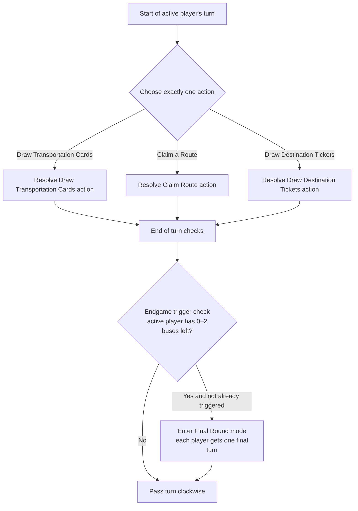
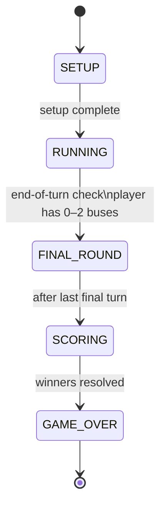

# Ticket to Ride: London — Implementation Specification

## Executive summary

Ticket to Ride: London is a fast-paced, turn-based route-connection game set in 1970s London. Players compete for points by (a) claiming bus routes between adjacent locations using matching Transportation cards, (b) completing secret Destination Tickets by forming a continuous network connecting the ticket's two named locations, and (c) earning a bonus for the Longest Continuous Path.

On a player's turn, exactly one of three actions is performed: draw Transportation cards, claim a route, or draw Destination Tickets. The game ends after a final round that is triggered when a player finishes a turn with 0–2 plastic buses remaining. Final scoring consists of (1) route points already earned during play, (2) adding/subtracting Destination Ticket values based on completion, and (3) awarding the 10-point Longest Continuous Path bonus (ties share the bonus). Tie-breakers are applied by completed-ticket count, then by possession of the Longest Continuous Path bonus.

This specification encodes rules, edge cases, data structures, validation constraints, and deterministic event sequencing needed to implement the game for the London map.

## Components, decks, and setup

### Component inventory and exact counts

All component counts below are taken from the official Ticket to Ride: London box contents as listed by Days of Wonder.

| Component | Exact count | Colors / notes |
|---|---:|---|
| Board map (London transportation network) | 1 | Shared board |
| Plastic Buses (playing pieces) | 68 | 17 each in Red/White/Blue/Yellow |
| Scoring Markers | 4 | 1 each: Red/White/Blue/Yellow |
| Transportation cards | 44 | 6 coloured types + Bus (wild); composition specified below |
| Destination Ticket cards | 20 | London ticket set; defined in `destination_cards.md` |
| Rule leaflet | 1 | Reference-only |

### Transportation card types and deck composition

The Transportation card deck contains **44 cards**: 6 regular colours plus Bus (wild). There are **6 cards** for each of the six regular colours and **8 Bus** (wild) cards.

Regular card colours used by the London edition are: **Blue, Green, Black, Pink, Yellow, Orange**.

| Transportation card type | Count |
|---|---:|
| Blue | 6 |
| Green | 6 |
| Black | 6 |
| Pink | 6 |
| Yellow | 6 |
| Orange | 6 |
| Bus (wild; multi-coloured) | 8 |
| **Total** | **44** |

The route colours on the board match the Transportation card colours. The 7th route colour, **Grey**, indicates a neutral route that may be claimed with any single colour set. Grey is not a card colour; it is a route-only designation.

Player colours (Red, White, Blue, Yellow) are the colours of the plastic bus pieces, **not** route or card colours. Red and White do not appear as route or card colours.

### Destination Ticket deck composition

The London edition includes **20** Destination Ticket cards. Each ticket specifies two locations and a point value. The full list is defined in `destination_cards.md`.

### Setup procedure

Setup must be executed in the following sequence.

1. The board map must be placed in the centre of the play area.
2. Each player must take one full set of **17 plastic buses** of a single player colour and the matching scoring marker. The scoring marker must be placed at "Start" on the scoring track.
3. The Transportation cards must be shuffled, then **2** Transportation cards must be dealt to each player as a starting hand.
4. The remaining Transportation card deck must be placed near the board, and the **top 5** cards must be turned face-up to form the "face-up display."
5. If 3 or more of the 5 initial face-up cards are Bus (wild) cards, all 5 must be discarded and replaced with 5 new face-up cards. Repeat until fewer than 3 Bus cards appear among the 5 face-up cards.
6. Destination Tickets must be shuffled, then **2** Destination Tickets must be dealt to each player. Each player must keep at least **1** of these initial 2 tickets (optionally both). Any returned tickets must be placed on the **bottom** of the Destination Ticket deck. The Destination Ticket deck must then be placed near the board. Destination Tickets must be kept secret until final scoring.

**First player selection:** The player deemed "most experienced traveller" is specified to go first; play proceeds clockwise thereafter.
**Implementation allowance:** If "most experienced traveller" cannot be determined programmatically, a manual selection UI or random selection may be used, but it must be treated as a pre-game configuration step (not a rule effect).

## Core rules and player turn flow

### Fundamental invariants

The following invariants must hold throughout play:

- A player's Transportation card hand size is unlimited.
- A player's Destination Ticket count in hand is unlimited.
- On each turn, exactly one of the three turn actions must be selected and fully resolved.
- When a route is claimed, it becomes unavailable to other players (subject to double-route rules).

### Turn structure

On a player's turn, exactly **one** action must be performed. The three actions are:

- Draw Transportation Cards
- Claim a Route
- Draw Destination Tickets



Endgame triggering conditions and final-round sequencing are specified in detail later.

### Action specification: Draw Transportation Cards

#### Official rule summary

When this action is taken, up to **2** Transportation cards may be drawn, using any combination of:
- selecting from the five face-up cards, and/or
- blind-drawing from the top of the Transportation card draw deck.

If a face-up card is taken, it must be immediately replaced by turning the top card of the draw deck face-up.

Bus (wild) cards impose special constraints:
- If a face-up Bus card is taken, only **one** card may be drawn for that entire action.
- If, after having drawn one card, a replacement card turned face-up is a Bus card, that Bus card cannot be taken as the second card of the action.
- If at any time **3 of the 5** face-up cards are Bus cards, all five face-up cards must be discarded and replaced by five new face-up cards.
- If a Bus card is blind-drawn from the top of the deck, it counts as a normal single card draw and does not restrict the second draw.

The discard pile must be reshuffled into a new draw pile when the draw pile is exhausted. If both draw pile and discards are empty, Transportation card drawing is not possible.

#### Machine-actionable draw procedure

**State variables used**
- `transportDeck.drawPile` (stack; top is next draw)
- `transportDeck.discardPile` (stack)
- `faceUpDisplay[0..4]` (array of cards; may contain Bus cards)
- `turnContext.drawAction` (ephemeral, per-turn, for enforcing "replacement-bus-card lock")

**Procedure: `performAction_DrawTransportCards(playerId)`**

1. Initialize `drawsTaken = 0`.
2. Initialize `replacementBusLocked = false` and `lockedFaceUpIndex = null`.
3. While `drawsTaken < 2`:
   - If `canDrawAnyTransportCard()` is false (no draw pile, no discard pile, and no face-up cards available), the action must end immediately with `drawsTaken` cards drawn (possibly 0).
   - The player must select one draw source:
     - `FACE_UP(index)` where `faceUpDisplay[index]` exists
     - `BLIND_DRAW` (top of draw pile)
   - Validate the selection using the constraints below.
   - Execute draw:
     - If `BLIND_DRAW`:
       - Ensure draw pile has at least 1 card; if not, reshuffle discards into draw pile (see reshuffle rule).
       - Pop 1 card from draw pile; add to player hand; increment `drawsTaken`.
       - If drawn card is a Bus card, do **not** reduce the allowed remaining draws (blind Bus card is treated as a normal single draw).
     - If `FACE_UP(index)`:
       - Remove the face-up card and add it to player hand; increment `drawsTaken`.
       - Refill that face-up slot immediately by drawing the top card of draw pile; if draw pile is empty, reshuffle discards into draw pile and continue; if still empty, the slot becomes empty (cannot be refilled).
       - If `drawsTaken == 1` and the refill card is a Bus card, set `replacementBusLocked = true` and `lockedFaceUpIndex = index`, preventing that specific Bus card from being selected as the second draw.
       - After any face-up change (replacement), evaluate the "3 Bus cards" flush rule (see below).
       - If the drawn face-up card was a Bus card, the draw action must end immediately (no second card may be drawn).
4. End the action.

**Validation constraints for the draw action**
- If a face-up Bus card is selected and `drawsTaken == 1`, this selection must be rejected because taking a face-up Bus card limits the player's draw action to one total card.
- If `replacementBusLocked == true`, then selecting `FACE_UP(lockedFaceUpIndex)` must be rejected as the second draw.

#### Face-up "three Bus cards" flush rule

**Rule trigger:** Whenever the face-up display contains 5 cards and at least 3 of them are Bus cards, the entire display must be discarded and replaced with five new face-up cards.

**Procedure: `enforceFaceUpBusFlush()`**
1. If face-up display size is 5 and `countBusCards(faceUp) >= 3`:
   - Move all 5 face-up cards to `transportDeck.discardPile`.
   - Refill face-up by drawing 5 cards from draw pile, reshuffling discards into draw pile if needed.
2. Repeat this check until the condition is false or until fewer than 5 cards can be displayed due to total supply exhaustion.

#### Transportation deck exhaustion and reshuffle

**Rule:** When the Transportation card draw pile is exhausted, the discard pile must be reshuffled to form a new draw pile. If both are empty (e.g., because players are holding many cards), Transportation card drawing cannot be performed.

**Procedure: `ensureDrawPileNotEmpty()`**
- If `drawPile.isEmpty()` and `discardPile.notEmpty()`:
  - Move all discard cards into draw pile and shuffle uniformly.
- If `drawPile.isEmpty()` and `discardPile.isEmpty()`:
  - No reshuffle is possible; drawing from the deck is impossible.

### Action specification: Claim a Route

#### Official rule summary

To claim a route:
- A set of Transportation cards equal to the number of spaces on the route must be played.
- The set must be "of the same type"; most routes require a specific colour, while grey routes allow any single colour to be used.
- Bus cards act as wild cards and may be included in sets.
- The player must place one of their plastic buses on each space of the route, then discard the cards used, and score points according to the Route Scoring Table.
- Only one route may be claimed per turn; it connects exactly two adjacent locations (a single printed route).
- A route may be claimed even if it does not connect to the player's existing network.

Double-route restrictions:
- A single player may not claim both routes of a double-route pair.
- In **2-player games**, only one of the two routes in a double-route pair may be used; once one is claimed, the other is closed to all players.

#### Route definition

A "route" is a single printed connection between two adjacent locations, comprised of `length` contiguous spaces. Claiming a route claims all spaces of that printed connection in a single action; partial claiming is not permitted. London routes have lengths of 1, 2, 3, or 4.

#### Machine-actionable claim procedure

**State variables used**
- `board.routes[routeId]` (immutable printed routes, plus claim status)
- `player.busesRemaining` (starts at 17)
- `player.handTransportCards` (multiset)
- `transportDeck.discardPile`
- `player.score` (integer; or scoring marker position)

**Procedure: `performAction_ClaimRoute(playerId, routeId, payment)`**
1. Validate route availability:
   - `route.claimedBy == null` must be true.
   - If `route.doubleGroupId != null`:
     - If `player` already owns a route in the same `doubleGroupId`, reject (single player may not claim both).
     - If `playerCount == 2` and any route in that `doubleGroupId` is already claimed by any player, reject (the other is closed).
2. Validate bus piece availability:
   - `player.busesRemaining >= route.length` must be true (required to place a bus in each space).
3. Validate payment:
   - `payment.cards.length == route.length` must be true.
   - All non-Bus cards in `payment` must be the same colour (the "set of the same type" constraint).
   - If `route.color != GREY`:
     - All non-Bus cards in `payment` must match `route.color`. Bus cards may substitute for missing required colour.
   - If `route.color == GREY`:
     - The chosen payment colour is defined as the common non-Bus colour (or "none" if all are Bus cards); any single-colour set is permitted.
   - Each payment card must exist in the player's hand multiset (no overdraft).
4. Apply claim:
   - Remove payment cards from player hand and push them to `transportDeck.discardPile`.
   - Set `route.claimedBy = playerId`.
   - Decrement `player.busesRemaining -= route.length`.
5. Score immediately:
   - Add `routePoints(route.length)` to `player.score`.
6. End action.

### Action specification: Draw Destination Tickets

#### Official rule summary

When this action is taken:
- **2** Destination Tickets must be drawn from the top of the Destination Ticket deck.
- At least **1** of these drawn tickets must be kept; both may be kept.
- Any returned tickets must be placed on the bottom of the deck.
- If fewer than 2 tickets remain in the deck, only the available tickets are drawn.

Destination Tickets are kept secret until final scoring.

#### Machine-actionable procedure

**Procedure: `performAction_DrawDestinationTickets(playerId, keepSet)`**
1. Let `n = min(2, destinationTicketDeck.size)`.
2. If `n == 0`, the action must be rejected as invalid (because the rule requires at least one kept ticket but none can be drawn).
3. Draw `n` tickets from the top of the deck into a temporary revealed set `drawnTickets`.
4. The player must choose `keepSet ⊆ drawnTickets` such that `|keepSet| >= 1`.
5. Add `keepSet` to the player's ticket hand.
6. Place `drawnTickets \ keepSet` onto the bottom of the Destination Ticket deck.
   - **Ordering note:** The rules specify bottom placement but not ordering. A deterministic implementation should preserve the original drawn order for the returned subset.
7. End action.

## Route claiming and scoring

### Route scoring table

Points gained immediately upon claiming a route depend only on route length (number of spaces / buses placed).

| Route length (spaces) | Points awarded |
|---:|---:|
| 1 | 1 |
| 2 | 2 |
| 3 | 4 |
| 4 | 7 |

The London board only has routes of length 1–4. There are no routes of length 5 or 6 (unlike the North America edition).

### Colour matching and grey routes

- For a coloured route, the required set colour is fixed by the route's printed colour; Bus cards may substitute.
- For a grey route, any single colour set may be used; Bus cards may substitute within that set.

### Sprint 3 Ferry routes

Ferry routes are special printed routes across the Thames. They use the same route endpoints,
length, scoring, bus placement, and double-route rules as other routes, but add mandatory
Bus-symbol payment requirements.

Selected London ferry routes:

| Route | Endpoints | Colour | Length | Required Bus symbols |
|---|---|---|---:|---:|
| R28 | Big Ben to Waterloo | Blue | 1 | 1 |
| R39 | Globe Theatre to Tower of London | Grey | 3 | 1 |
| R42 | St Paul's to Globe Theatre | Grey | 1 | 1 |
| R43 | St Paul's to Globe Theatre | Grey | 1 | 1 |

Ferry payment rules:

- Each required Bus symbol must be satisfied by either one Bus card or any three Transportation
  cards used as a substitute bundle.
- Cards used in a three-card substitute bundle satisfy only the Bus symbol and do not also count
  toward the route's remaining spaces.
- Remaining route spaces still follow normal coloured or grey route matching.
- Extra Bus cards may be used as wild cards for remaining coloured or grey route spaces.
- The number of plastic buses placed and route points awarded are based on the printed route
  length, not the total number of cards paid.

### Sprint 3 Rush Hour Events

Rush Hour Events are a self-defined Sprint 3 extension. They add a turn-based congestion clock to
route claiming:

- Forecast phase lasts one full round (`playerCount` completed turns). A future event is visible,
  and affected routes are highlighted, but there is no payment or scoring effect yet.
- Peak phase lasts one full round. Routes affected by the active event require exactly one extra
  Transportation card as a detour payment.
- The detour card may be any Transportation card, including Bus, but it is separate from the normal
  route/Ferry payment and cannot satisfy both requirements.
- Successfully claiming an affected route during Peak awards the normal route points plus a +2 Rush
  Hour bonus immediately.
- Rush Hour bonus points are tracked for display and scoring breakdown, but final scoring must not
  add them a second time.
- The Rush Hour clock advances only after a complete turn ends, including completed multi-step
  Transportation card draws.

### Double-routes

**Definition:** A "double-route" is a pair of parallel printed routes connecting the same two locations.

The London board has **8 double-route pairs**:
1. Piccadilly Circus ↔ Covent Garden (Green 1 / Yellow 1)
2. Piccadilly Circus ↔ Trafalgar Square (Blue 1 / Orange 1)
3. Covent Garden ↔ Trafalgar Square (Black 1 / Pink 1)
4. Covent Garden ↔ St Paul's (Grey 4 / Grey 4)
5. Hyde Park ↔ Buckingham Palace (Yellow 1 / Orange 1)
6. St Paul's ↔ Tower of London (Pink 3 / Yellow 3)
7. Piccadilly Circus ↔ Hyde Park (Grey 2 / Grey 2)
8. St Paul's ↔ Globe Theatre (Grey 1 / Grey 1)

**Restrictions:**
- A single player may not claim both halves of a double-route pair.
- In **2-player games**, only one half of the pair may be used: once one is claimed, the other becomes closed to all players.

**Implementation encoding:** Each printed route should optionally contain a `doubleGroupId`. Routes without a `doubleGroupId` are single routes. A double-route pair is represented by two distinct route objects sharing the same `doubleGroupId`, location endpoints, and (possibly differing) colour/length.

### Claiming "any open route" and connectivity independence

A claim does not need to connect to the player's existing network; any available route on the board may be claimed if costs and restrictions are met.

### Discarding paid cards

All Transportation cards used to claim a route must be discarded to the Transportation card discard pile immediately after the claim is resolved.

## Destination tickets, endgame, and tie-breakers

### Destination Ticket semantics and completion

Each Destination Ticket specifies:
- two location names (endpoints), and
- a point value.

At final scoring:
- If the player has built a continuous path (a connected set of their claimed routes) connecting the two locations, the ticket's point value must be **added**.
- Otherwise, the ticket's point value must be **subtracted**.

**Connectivity definition (machine interpretation):** A ticket is completed if and only if, in the graph formed by the player's claimed routes (edges weighted by route length but unweighted for reachability), the two endpoint locations are in the same connected component.

**Ticket secrecy:** Tickets must remain hidden from other players until final scoring.

### Endgame trigger and final round sequencing

**Trigger condition:** When any player finishes their turn with **0, 1, or 2** plastic buses remaining, the final round is triggered.

**Final round rule:** After the trigger, each player, including the triggering player, receives exactly **one final turn**.

**Implementation sequencing (canonical):**
- The trigger is checked at the end of a player's turn.
- If it triggers for the first time:
  - Set `finalRound.active = true`
  - Set `finalRound.turnsRemaining = playerCount`
  - Set `finalRound.triggeringPlayerId = currentPlayerId`
  - Proceed to the next player clockwise as usual.
- Decrement `finalRound.turnsRemaining` by 1 after each subsequent turn ends (including the triggering player's eventual "one final turn" when the rotation returns).
- When `finalRound.turnsRemaining == 0`, the game ends immediately after that turn and scoring begins.

This sequencing satisfies the published requirement that the triggering player also receives one final turn (in addition to the turn that caused the trigger).

### Final scoring sequence

Final scoring must be computed in this order:

1. **Route points:** These have typically been scored during play; recounting is optionally suggested to verify correctness. In a digital implementation, route points should be recomputable from claimed routes to ensure correctness.
2. **Destination Tickets:** Reveal all Destination Tickets, then add/subtract each ticket's value depending on completion.
3. **Longest Continuous Path bonus:** Award +10 points to the player(s) with the longest continuous path of their own routes, as defined below.

**Project scoring decision:** This implementation intentionally uses the +10 Longest Continuous Path
bonus from the broader Ticket to Ride family. It does not award Ticket to Ride: London's printed
district bonus. District numbers remain in the board data for rendering and possible Sprint 3
extension work only.

### Longest Continuous Path bonus

**Award:** The Longest Continuous Path bonus is worth **+10 points**.

**Definition (official constraints):**
- Only continuous lines of the player's own plastic buses are considered (i.e., only that player's claimed routes).
- A continuous path may include loops and may pass through the same location multiple times.
- A specific claimed route segment (edge/space) may not be used twice in the same continuous path.
- If tied for longest, all tied players receive the +10 points.

**Machine interpretation:** This is the maximum total-length **trail** in the player's claimed-route multigraph: vertices may repeat, edges may not repeat.

### Win condition and tie-breakers

- The player with the most points wins.
- If tied on points, the player who completed the most Destination Tickets wins.
- If still tied, the player who has the Longest Continuous Path bonus wins.

**Implementation note (rare tie persistence):** If multiple tied players also share the Longest Continuous Path bonus (a tie for longest path), the published tie-breaker does not strictly resolve the tie further. In that case, the result should be recorded as a shared win.

## Formal data model, state machine, and validation rules

### Data structures

The following schemas separate **engine rules** from **map content**.

```java
// Core enums
public enum PlayerColor { RED, WHITE, BLUE, YELLOW }

public enum CardColor { BLUE, GREEN, BLACK, PINK, YELLOW, ORANGE, BUS }

public enum RouteColor { BLUE, GREEN, BLACK, PINK, YELLOW, ORANGE, GREY }

public enum GamePhase { SETUP, RUNNING, FINAL_ROUND, SCORING, GAME_OVER }
```

**Key data values for the London map:**

| Data point | Value |
|---|---|
| Players | 2–4 |
| Buses per player | 17 |
| Transportation card deck | 44 (6 × 6 regular + 8 Bus wild) |
| Regular card colours | Blue, Green, Black, Pink, Yellow, Orange |
| Destination Tickets | 20 |
| Starting hand | 2 Transportation cards |
| Face-up display | 5 cards |
| Setup ticket deal | 2 per player, keep ≥ 1 |
| Mid-game ticket draw | 2 from deck, keep ≥ 1 |
| Board locations | 17 |
| Board routes | 43 printed routes (27 standalone routes + 8 double-route pairs) |
| Route lengths | 1, 2, 3, 4 |
| Route scoring | 1→1, 2→2, 3→4, 4→7 |
| Double-route restriction | 2-player games only |
| End-game trigger | 0–2 buses remaining at end of turn |
| Longest Continuous Path bonus | +10 points (ties share) |
| Bus card flush rule | 3+ of 5 face-up are Bus → discard all 5 and replace |
| Districts | 5 |

### Board data

The 17 London locations and 43 printed routes are defined in `london_board_layout.md`. The 20 Destination Tickets are defined in `destination_cards.md`. These files are the authoritative data sources.

### Game state transitions



The end-of-turn trigger for FINAL_ROUND and the "one final turn each" requirement must match the official "0, 1, 2 buses left at end of turn" rule.

### Validation rules by action

The following validation checks must be enforced before an action is committed:

**Draw Transportation Cards**
- Must be rejected if the player cannot possibly draw any Transportation card (no draw pile, no discard pile, and no face-up cards to take).
- A face-up Bus card may not be taken as the second card of the action (because taking a face-up Bus card limits the action to one card total).
- If the first draw was a face-up non-Bus card and its immediate replacement was a Bus card, that replacement may not be taken as the second card.
- After any face-up update, the "3 Bus cards" flush rule must be applied.

**Claim a Route**
- Route must be unclaimed.
- Player must have enough buses remaining to fill the route's length.
- Payment must contain exactly `route.length` cards, all "same type" except Bus cards as wild; coloured routes restrict colour accordingly; grey routes allow any single colour.
- Ferry route payments may contain more than `route.length` cards when three-card substitute
  bundles are used for required Bus symbols.
- Double-route restrictions must be applied, including the 2-player "only one may be used" rule.

**Draw Destination Tickets**
- Must draw up to 2 from top; if fewer than 2 remain, draw only those available.
- Must keep at least 1 drawn ticket.
- Returned tickets must be placed on the bottom of the deck.
- If 0 tickets remain, action must be rejected as impossible.

### Algorithms required for scoring

#### Ticket completion check

For each player:
- Build an undirected graph of locations using the player's claimed routes as edges.
- For each ticket `(A, B, points)`:
  - Completed if `A` is reachable from `B` via BFS/DFS/Union-Find.
  - Add `+points` if completed else `-points`.

#### Longest Continuous Path computation

Because edges (routes) have lengths and edge reuse is forbidden while vertex revisit is allowed, the target is the maximum-weight trail.

A correct (and typically fast enough) approach for the London board:
- Represent each claimed route as an edge with weight `length`.
- Run depth-first search from every location, tracking used edges in a bitset/set, accumulating total length.
- The maximum accumulated length over all trails is that player's longest continuous path length.
- Award +10 to all players with maximal value.

This is computationally feasible because a single player will claim at most ~15 routes on the London board.

### Example playthrough illustrating edge cases

This example exercises edge cases covered by the official rules: immediate face-up replacement, face-up Bus card restrictions, the "replacement becomes Bus card" limitation, the "3 Bus cards" flush, double-route restrictions in 2-player games, and the final-round trigger at 0–2 buses remaining.

**Game configuration**
- 2 players: Red (P1), Blue (P2).
- Because player count is 2, only one half of any double-route pair may be used (once claimed, the other closes).

**Setup (abbreviated)**
- Each player is dealt 2 Transportation cards.
- 5 face-up Transportation cards are revealed.
- Each player is dealt 2 Destination Tickets and must keep at least 1.

**Edge case A: face-up display shows 3 Bus cards**
- Suppose the initial face-up reveal contains 3 Bus cards.
- The face-up display must be discarded and replaced with 5 new face-up cards immediately.

**Turn 1 (P1 / Red): Draw Transportation Cards**
1. P1 takes a face-up **Green** card as the first draw.
2. The taken face-up card must be immediately replaced from the deck.
3. The replacement card turned face-up is a **Bus** card.
4. Because the replacement is a Bus card after one card has already been drawn, that replacement Bus card may not be taken as P1's second draw.
5. P1 takes the second draw as a blind draw from the top of the deck instead.
6. If the blind draw happens to be a Bus card, it still counts as only one card; drawing two total cards is still allowed.

**Turn 2 (P2 / Blue): Draw Transportation Cards; face-up Bus card taken**
1. P2 selects a face-up **Bus** card as the first draw.
2. Because a face-up Bus card was drawn, P2 may draw only one card this turn (no second draw).
3. The Bus card slot is refilled immediately; after refill, the "3 Bus cards among 5 face-up" condition is checked and applied if met.

**Turn 3 (P1 / Red): Claim a route**
- P1 claims a grey route of length 4 (e.g., Baker Street → Piccadilly Circus) by paying 4 cards of the same colour (e.g., 4 Orange), then places 4 buses and scores 7 points.

**Midgame edge case B: double-route claimed in a 2-player game**
- P1 claims one half of the Piccadilly Circus ↔ Covent Garden double-route pair (the Green route).
- Because the game has 2 players, the other half (the Yellow route) is now closed to all players for the rest of the game.
- If P2 later attempts to claim the Yellow half, the action must be rejected as illegal.

**Late game edge case C: Transportation card deck exhaustion**
- When the Transportation card draw pile becomes empty, the discard pile must be reshuffled to form a new draw pile.
- If both draw pile and discard pile are empty (rare), the Draw Transportation Cards action must be unavailable; only Claim Route or Draw Destination Tickets may be chosen.

**Endgame edge case D: final round trigger**
- P2 ends a turn with 2 buses remaining.
- This triggers the final round: each player, including P2, receives one final turn.
- After the last final turn resolves, the game ends and final scoring begins.

**Final scoring edge case E: incomplete tickets and longest-path tie**
- All players reveal Destination Tickets and add/subtract based on completion.
- Longest Continuous Path is computed; if P1 and P2 are tied, both receive +10.
- If total points are tied after bonuses, the player with more completed Destination Tickets wins; if still tied, the Longest Continuous Path bonus is the tie-breaker.

---

Advanced Requirements for Final Prototype (Sprint 3 deliverable): A number of extensions are to be implemented for the final prototype. Therefore, the design of the game implementation must be flexible enough to cater for a variety of extensions, some given by the client, some chosen by yourselves (note that Sprint 3 is an individual sprint). One extension that is very likely to be on the list is the option to have different board configurations (e.g., different countries and routes) and additional rules. Consequently, your design must be flexible enough so that you could easily accommodate different board configurations and rules. A further extension that is very likely to be on the list of extensions is to increase the number of players to 3 or 4. Again, your design will need to be flexible enough to cater for a different number of players. Finally, we may require saving and loading of games to an external medium (e.g., a file) to be available in the final sprint.
